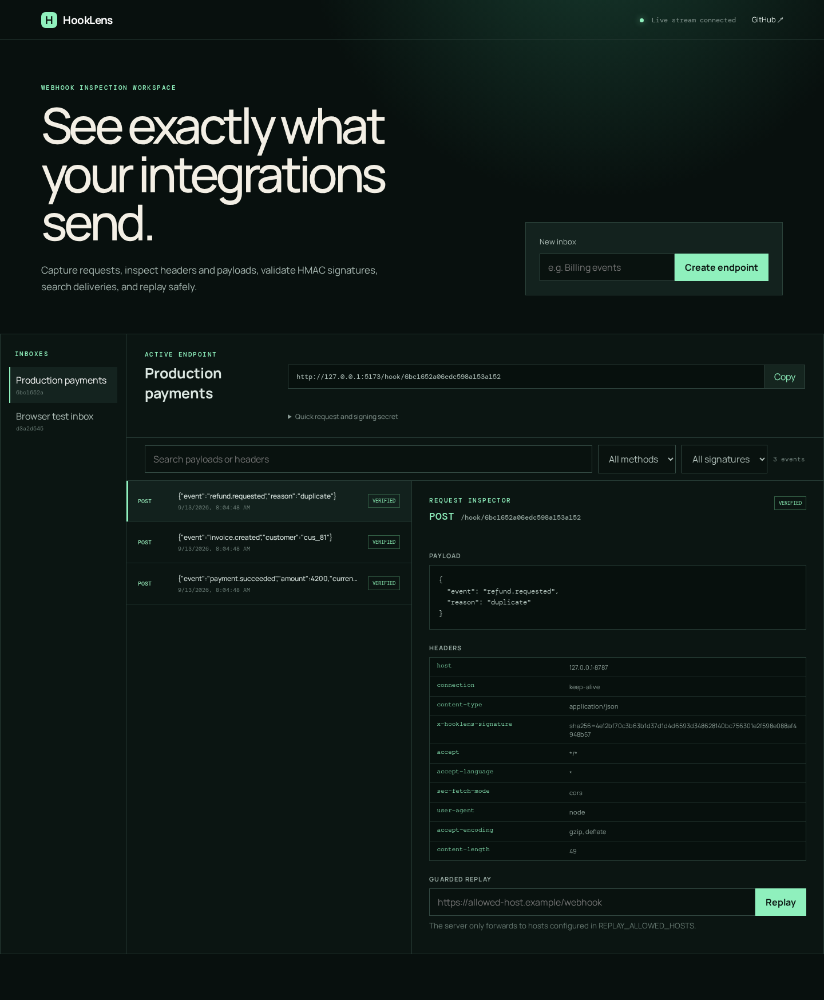
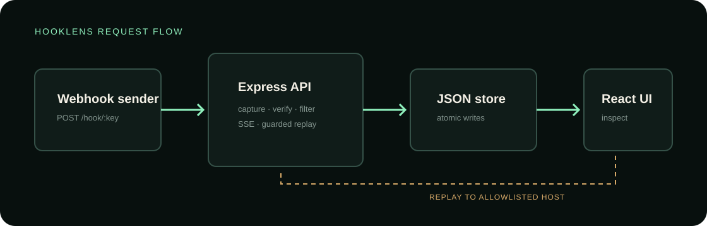

# HookLens

[](https://github.com/merak-max/hooklens/actions/workflows/ci.yml)
[](https://github.com/merak-max/hooklens/releases)
[](LICENSE)

HookLens is a self-hosted webhook inspection workspace. It creates isolated capture endpoints, streams deliveries into a browser in real time, exposes the original headers and payload, verifies HMAC-SHA256 signatures, supports server-side search and filters, persists events, and can replay a delivery to an explicitly allowlisted host.

> HookLens is an independent portfolio project. It is not presented as a production-ready multi-tenant webhook service.



## Why this project exists

Webhook integrations are difficult to debug when the receiving application only records a generic failure. HookLens makes the actual HTTP boundary visible while treating replay as a security-sensitive operation rather than an unrestricted proxy.

## Features

- Generated webhook URL and HMAC signing secret per inbox
- Capture of any HTTP method, request headers, query values, content type, and body
- Live updates through Server-Sent Events
- Payload/header search plus method and signature-state filters
- Constant-time HMAC-SHA256 signature comparison via `x-hooklens-signature`
- File-backed JSON persistence with serialized atomic writes
- Guarded replay restricted by `REPLAY_ALLOWED_HOSTS`, with private IP literals blocked
- Responsive React inspection workspace
- Node API tests, Playwright browser tests, CI, and a multi-stage Docker image

## Architecture



The Express service owns capture, verification, persistence, streaming, and replay. The React app uses the REST API for queries and an SSE connection for new deliveries. A single Docker container serves both the API and the compiled frontend.

## Local development

Requirements: Node.js 24 and Corepack.

```sh
corepack enable
pnpm install
pnpm dev
```

Open `http://localhost:5173`. The API listens on `http://localhost:8787` and Vite proxies application requests to it.

## Send a signed event

Create an inbox in the UI, then calculate a signature over the exact request bytes:

```sh
body='{"event":"order.created","id":"ord_42"}'
signature=$(printf '%s' "$body" | openssl dgst -sha256 -hmac 'YOUR_INBOX_SECRET' -hex | sed 's/^.* //')

curl -X POST 'YOUR_GENERATED_ENDPOINT' \
  -H 'content-type: application/json' \
  -H "x-hooklens-signature: sha256=$signature" \
  -d "$body"
```

## Verification

```sh
pnpm check
pnpm exec playwright install chromium
pnpm test:e2e
```

## Docker

```sh
docker compose up --build
```

The application is then available at `http://localhost:8787`. Event data is stored in the `hooklens-data` volume.

Replay is disabled for every host not named in `REPLAY_ALLOWED_HOSTS`:

```sh
REPLAY_ALLOWED_HOSTS=hooks.example.com,events.example.com docker compose up --build
```

## Security boundaries

- Captured requests are limited to 1 MiB.
- API JSON bodies are limited to 64 KiB.
- Replay supports only HTTP(S), blocks loopback/private IP literals, does not follow redirects, and requires an exact hostname allowlist match.
- The repository contains no default credentials or hosted service keys.
- This MVP has no user authentication. Do not expose it as a public shared service without the controls listed in [SECURITY.md](SECURITY.md).

## Contributing

Bug reports and focused improvements are welcome. Read [CONTRIBUTING.md](CONTRIBUTING.md) for the development workflow, required checks, and security-reporting boundary.

## License

[MIT](LICENSE)
