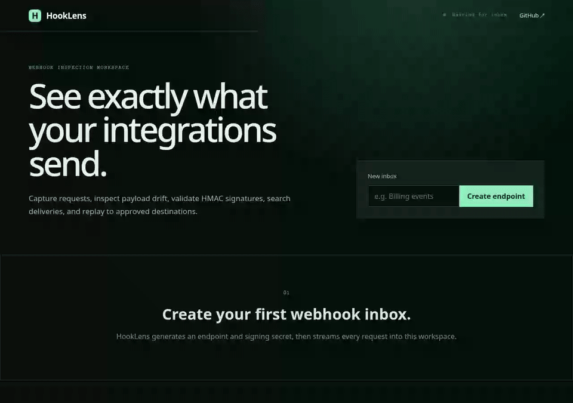
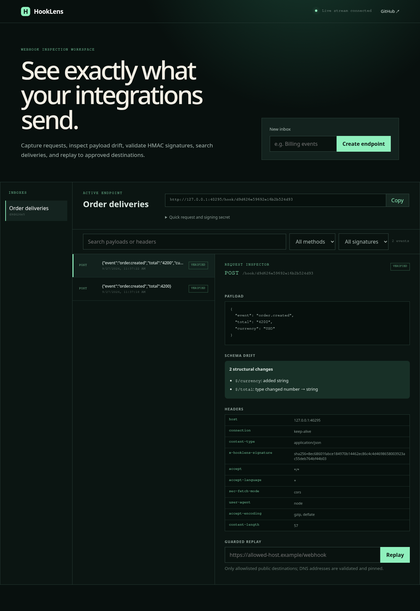
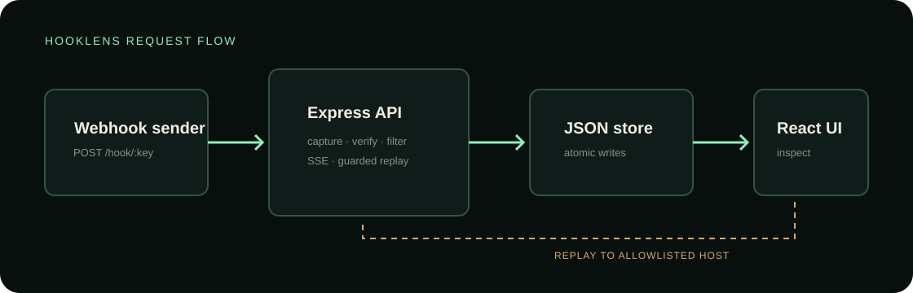

# HookLens

[](https://github.com/merak-max/hooklens/actions/workflows/ci.yml)
[](https://github.com/merak-max/hooklens/releases)
[](LICENSE)



[Try the browser sandbox](https://merak-max.github.io/hooklens/) ·
[Benchmarks](benchmarks/README.md) · [Why SSE](docs/why-sse.md) ·
[Replay threat model](docs/replay-threat-model.md)

The hosted sandbox is explicitly **simulated**: no real webhook endpoint,
outbound replay, or shared storage. Its data exists only in your tab and resets
on reload. The recording above uses the real local HTTP API with signed,
synthetic requests. Run the service below for real capture.

HookLens is a self-hosted webhook inspection workspace. It creates isolated capture endpoints, streams deliveries into a browser in real time, exposes the original headers and payload, verifies HMAC-SHA256 signatures, supports server-side search and filters, persists events, and can replay a delivery to an explicitly allowlisted host.

> HookLens is an independent portfolio project. It is not presented as a production-ready multi-tenant webhook service.



## Why this project exists

Webhook integrations are difficult to debug when the receiving application only records a generic failure. HookLens makes the actual HTTP boundary visible while treating replay as a security-sensitive operation rather than an unrestricted proxy.

## Features

- Generated webhook URL and HMAC signing secret per inbox
- Capture of any HTTP method, request headers, query values, content type, and body
- Live updates through Server-Sent Events
- Payload/header search plus method and signature-state filters
- Constant-time HMAC-SHA256 signature comparison via `x-hooklens-signature`
- File-backed JSON persistence with serialized atomic writes
- Guarded replay restricted by `REPLAY_ALLOWED_HOSTS`, with private IP literals blocked
- DNS-aware replay checks with connection pinning, a deadline, and no redirects
- Structural schema-drift detection: added, removed, and type-changed JSON paths
- Optional single-owner management authentication; required outside loopback
- Bounded capture storage, per-IP request limits, and bounded SSE connections
- Responsive React inspection workspace
- Node API tests, Playwright browser tests, CI, and a multi-stage Docker image

## Architecture



The Express service owns capture, verification, persistence, streaming, and replay. The React app uses the REST API for queries and an SSE connection for new deliveries. A single Docker container serves both the API and the compiled frontend.

## Local development

Requirements: Node.js 24 and Corepack.

```sh
corepack enable
pnpm install
pnpm dev
```

Open `http://127.0.0.1:5173`. The API listens on `127.0.0.1:8787` and Vite
proxies application requests to it. Both development servers bind to loopback. Set
`HOOKLENS_TOKEN` to a random value of at least 24 characters to protect the
management UI and API. The browser signs in through a same-origin, HttpOnly,
SameSite=Strict cookie; CLI clients use `Authorization: Bearer ...`. Webhook
capture uses the separate random inbox URL and verifies signatures when provided.
An invalid or absent signature is recorded for inspection, not rejected.

For a network deployment, explicitly configure `HOST`, `HOOKLENS_TOKEN`,
`PUBLIC_BASE_URL`, and `COOKIE_SECURE=true` behind HTTPS. `PUBLIC_BASE_URL`
must match the browser's origin. Forwarded IP headers are not trusted; enforce
per-client limits at your ingress as well. This is a single-owner workspace,
not an authenticated multi-tenant product.

## Send a signed event

Create an inbox in the UI, then calculate a signature over the exact request bytes:

```sh
body='{"event":"order.created","id":"ord_42"}'
signature=$(printf '%s' "$body" | openssl dgst -sha256 -hmac 'YOUR_INBOX_SECRET' -hex | sed 's/^.* //')

curl -X POST 'YOUR_GENERATED_ENDPOINT' \
  -H 'content-type: application/json' \
  -H "x-hooklens-signature: sha256=$signature" \
  -d "$body"
```

## Verification

```sh
pnpm check
pnpm exec playwright install chromium
pnpm test:e2e
pnpm test:demo
```

## Docker

```sh
export HOOKLENS_TOKEN="$(openssl rand -hex 24)"
docker compose up --build
```

The application is then available at `http://localhost:8787`, bound to host
loopback only. Sign in with the generated management token. Synthetic demo/test
data is separate from this persistent `hooklens-data` volume.

Replay is disabled for every host not named in `REPLAY_ALLOWED_HOSTS`:

```sh
REPLAY_ALLOWED_HOSTS=hooks.example.com,events.example.com docker compose up --build
```

## Security boundaries

- Captured requests and management JSON bodies are limited to 64 KiB.
- Capture and management requests share a 600-request/minute direct-client-IP limit;
  login attempts additionally have a ten-request/minute limit.
- Replay supports only HTTP(S), rejects credentials, checks every DNS address,
  pins the connection to a validated public IP, and never follows redirects.
- One process retains at most 20 inboxes, 1,000 events and an 8 MiB JSON snapshot.
  Events expire after seven days; a minute-level sweep removes expired data.
  The write queue is bounded at 64 pending operations. Oldest events are evicted
  under count/byte pressure. Retention does not delete inbox signing secrets.
- Storage uses atomic rename, **not fsync**. Do not treat it as a billing ledger
  or share one data file between multiple processes.
- The repository contains no default credentials or hosted service keys.
- Management authentication is single-owner; all authenticated clients share
  access to all inboxes. See [SECURITY.md](SECURITY.md) before network deployment.

## Schema drift and measurements

The first JSON object/array in an inbox establishes a persisted structural
baseline. Later captures show added/removed paths and type changes in the
inspector. Captures are not rejected by drift. Arrays, optional fields and mixed
event families have limitations: see [schema-drift design](docs/schema-drift.md).

The signed-capture load test uses a separate local server, the default bounded
file store, and schema analysis. It reports actual latency and storage limits,
not a sub-10ms promise. [Reproduce and inspect the raw reports](benchmarks/README.md).

Measured September 27, 2026 on Linux/ARM64, eight logical CPUs, Node 24.21.0;
3,000 measured requests after 1,000 warmups per run, 111-byte signed payloads:

| Clients | Requests/sec | p50 | p95 | p99 | Errors |
| ---: | ---: | ---: | ---: | ---: | ---: |
| 4 | 107.87 | 36.36 ms | 41.30 ms | 44.45 ms | 0 |
| 8 | 106.74 | 73.10 ms | 81.79 ms | 82.92 ms | 0 |

These are same-host closed-loop measurements with a full 1,000-event retention
window and no SSE viewers. More concurrency increases queueing, not throughput:
the serialized full-file snapshots are the bottleneck. Atomic rename does not
provide fsync durability. The reports include this limitation and peak server RSS.

To regenerate the real-app recording, install FFmpeg and Playwright Chromium,
then run `pnpm build && pnpm record:demo`. It creates and cleans up its own
temporary capture data. [External trial guide](docs/tester-guide.md) is ready
for volunteers; no external-user results are claimed yet.

## Contributing

Bug reports and focused improvements are welcome. Read [CONTRIBUTING.md](CONTRIBUTING.md) for the development workflow, required checks, and security-reporting boundary.

## License

[MIT](LICENSE)
